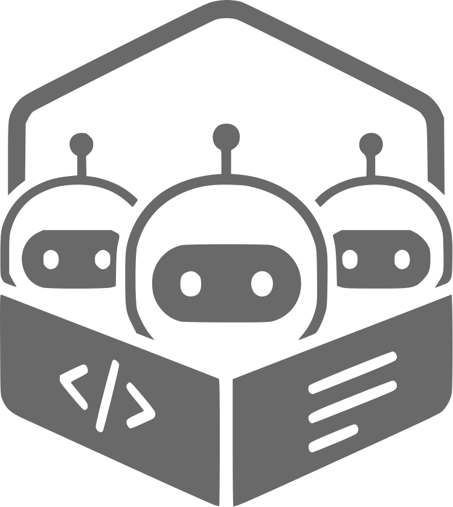

<div align="center">



# Pod Agents Manager

**A rootless Podman + Quadlet fleet manager for running and orchestrating local AI coding agents.**

[](LICENSE)
[](https://robvanvolt.github.io/pod-agents-manager/)
[](https://www.gnu.org/software/bash/)
[](https://podman.io/)
[]()

</div>

---

`pod` is a single-file Bash function that turns any Linux box with rootless Podman into a multi-tenant home for local coding agents — Claude Code, OpenCode, Crush, Pi, Hermes, Nanocoder, and anything else you wrap. Each instance lives in its own isolated container with a persistent workspace, talks to your local OpenAI-compatible inference server, and is started, joined, mirrored across `tmux`, batch-prompted, or torn down with one command.

A small Go-backed web dashboard exposes the same control surface over the LAN — including a "create new pod" form, live `podman stats`, and one-click start/stop/restart/delete.

## Highlights

- **Single-file fleet manager.** One `~/.pod_agents` Bash function, no daemons, no extra runtimes. Quadlet generates the systemd units, Podman runs them rootless under your user.
- **Pluggable agents.** Drop a `<name>.sh` into `~/.pod_agents_config/agents/`; it's auto-discovered, gets its own image, and gains a CLI verb. Ships with Claude, OpenCode, Crush, Pi, Hermes, Nanocoder, Little-Coder.
- **Composable Containerfile flavors.** `bun`, `uv`, etc. layer onto the base image automatically. Mix-and-match with `pod start <agent> <inst> <flavor>`.
- **Choose your base.** `node:current-alpine` (default, fast) or `node:current-trixie-slim` (Debian, broader compatibility) — switchable per pod or via `pod base`.
- **Batch prompting.** `pod batch prompts.txt` fans a list of prompts across every running pod, one prompt per session, sequentially or `--concurrent`. Live progress, log tailing in `tmux`, stop/resume per batch.
- **`tmux` grid view.** `pod tmux` opens a tiled grid with one pane per running pod — instant visual telemetry across the fleet.
- **Native LAN dashboard.** `pod server start` runs a small static Go binary on the host (no nested containers, uses the host's Podman directly). Bound on `0.0.0.0`, prints every reachable IP, exposes JSON APIs for stats, info, action, and create.
- **Skills are first-class.** `~/.pod_agents_config/skills/` is read-only-mounted into every pod at `/srv/skills`, then symlinked into each agent's expected path. Update once, every agent sees it.
- **Config persistence done right.** Per-instance workspaces live at `~/Developer/<agent>-pods/<instance>/`. Removing a pod doesn't touch its data; `delete` does.
- **Contributions welcome.** Pull requests for additional standard flavors, agents, and skills are welcome.

## Architecture

```
┌─ host (Debian / Alpine / anything with rootless Podman + systemd) ────────┐
│                                                                            │
│   ~/.pod_agents              ← single-file CLI (the `pod` function)        │
│   ~/.pod_agents_config/                                                    │
│     ├─ defaults.conf         ← OPENAI_BASE_URL, DEFAULT_MODEL, BASE_IMAGE  │
│     ├─ agents/<name>.sh      ← agent plugins (build + config)              │
│     ├─ flavors/*.containerfile   ← optional Containerfile snippets         │
│     ├─ volumes/*.volumes     ← reusable named volume bundles               │
│     ├─ skills/<skill>/       ← shared, read-only-mounted skills            │
│     ├─ batch/<id>/           ← batch state, logs, progress                 │
│     └─ server/               ← Go dashboard (binary runs on host)          │
│                                                                            │
│   ~/Developer/<agent>-pods/<instance>/   ← per-pod persistent workspace    │
│   ~/.config/containers/systemd/<agent>@.container   ← Quadlet units        │
│                                                                            │
│   pod-<agent>-<instance>     ← running rootless container (Podman)         │
│        └─ /workspace ↔ host workspace                                      │
│        └─ /srv/skills (ro)   ↔ host skills dir                             │
│        └─ env: OPENAI_BASE_URL, ANTHROPIC_BASE_URL, LLM, ...               │
└────────────────────────────────────────────────────────────────────────────┘
```

The shell function generates a Quadlet `*.container` template per agent, lets `systemctl --user daemon-reload` materialize it into a transient unit, and starts the pod via `systemctl --user start <agent>@<instance>.service`. Builds are cached at `~/.cache/podman-containers/`; image tags include both flavor and base, so cache hits are exact.

`pod update` rebuilds and restarts agent images for running instances. `pod self-update` refreshes the manager itself by downloading the latest repository snapshot and updating the managed files in `~/.pod_agents` and `~/.pod_agents_config/`.

## Requirements

| Component | Minimum | Notes |
|---|---|---|
| Linux | any modern distro | tested on Debian 12, Ubuntu 22.04+, Fedora 39+ |
| Podman | 4.x recommended, 5.8+ ideal | `pod` masks the buggy `podman-user-wait-network-online.service` on 5.0–5.7 automatically |
| systemd (user) | yes | rootless Podman uses `systemctl --user` and Quadlet |
| Bash | 4+ | the function uses associative-array idioms and `[[`/`<<<` |
| `tmux` | optional but recommended | needed for `pod tmux` and `pod batch tmux` |
| `go` | not required on host | the dashboard binary is built in a transient `golang:alpine` builder container if Go is missing |

An OpenAI-compatible inference endpoint is what each agent talks to. The shipped default points at `http://192.168.178.67:8008/v1` (a local LM-Studio / vLLM / TGI box) — change it in `defaults.conf`.

## Installation

```bash
curl -fsSL https://paperclip.gxl.ai/install.sh | bash
exec bash -l

# point it at your inference server (one-time)
$EDITOR ~/.pod_agents_config/defaults.conf

# (optional) prebuild every agent's image so first `pod start` is instant
pod prebuild
```

Manual install still works if you prefer a local clone:

```bash
git clone https://github.com/robvanvolt/pod-agents-manager.git
cd pod-agents-manager
bash ./install.sh
exec bash -l
```

Tab-completion is registered automatically. Type `pod ` and hit `<Tab>`.

To upgrade the manager itself later without touching your existing `defaults.conf` or extra custom files:

```bash
pod self-update
```

## Quickstart

```bash
# spin up a Pi coding agent on the alpine base, default flavor
pod start pi dev

# join its tmux session
pod join pi dev

# watch every running pod side-by-side in a tmux grid
pod tmux

# bring up the LAN dashboard (binds 0.0.0.0:1337)
pod server start

# fan a list of prompts across every running pod, sequentially per pod
pod batch prompts.txt

# … or only across all `pi` pods, in parallel:
pod batch pi prompts.txt --concurrent

# tear it down (keeps the workspace)
pod stop pi dev

# tear it down and delete the workspace
pod delete pi dev
```

Run `pod` with no args for an interactive menu.

## Command reference

```
Lifecycle           pod start | stop | restart | status | stats
                    pod remove | delete | remove-all | delete-all
Image management    pod prebuild [agent] [flavor] [volumes] [base]
                    pod update   [agent] [instance]
                    pod self-update
                    pod cache-clean
Interaction         pod join | enter | it [agent] [instance]
                    pod tmux [instance]
Batch prompting     pod batch <prompts.txt>
                    pod batch <agent> <prompts.txt>
                    pod batch <agent> <instance> <prompts.txt>
                    pod batch tmux | stats | list | stop [id]
                    Optional: --concurrent (per-pod parallelism)
Dashboard           pod server start | stop | restart | status | logs | build
Defaults            pod base <alpine|trixie-slim|...>
```

Every action accepts the same positional contract:

```
pod <action> [agent] [instance] [flavor] [volumes] [base]
```

Anything past `<action>` is optional; the interactive menu prompts for what's missing.

## Writing an agent plugin

Each file in `~/.pod_agents_config/agents/<name>.sh` defines two functions and (optionally) a few env vars:

```bash
# ~/.pod_agents_config/agents/my-agent.sh

# Where the agent expects its config inside the container.
AGENT_VOLUME_CONFIG_PATH="/root/.config/my-agent"

# Optional: where shared /srv/skills should be symlinked into the agent's config.
AGENT_SKILLS_SUBPATH="agent/skills"

# Optional: how `pod batch` should fire a single prompt at this agent.
# $PROMPT is set per-line by the batch runner.
AGENT_BATCH_INVOKE='my-agent --print "$PROMPT"'

# Build the Containerfile. Composes the chosen base + flavor + your install.
agent_build_containerfile() {
    local build_dir="$1"; local flavor="$2"; local base="$3"
    write_base_node_containerfile "$build_dir" "$flavor" "$base"
    cat <<'EOF' >> "$build_dir/Containerfile"
RUN npm install -g my-agent && npm cache clean --force
CMD ["tail", "-f", "/dev/null"]
EOF
}

# Generate per-instance config files inside the workspace.
agent_generate_config() {
    local config_dir="$1"; local action="$2"
    [ "$action" = "update" ] && return 0
    cat <<EOF > "$config_dir/config.json"
{ "baseUrl": "$OPENAI_BASE_URL", "apiKey": "$OPENAI_API_KEY", "model": "$DEFAULT_MODEL" }
EOF
}

# Optional: hook that runs once per `pod update` cycle (e.g. to pull a base image).
agent_pre_update() {
    podman pull docker.io/myorg/my-agent:latest
}
```

That's it. The plugin is auto-discovered the next time you run `pod`. No restart, no registry, no boilerplate.

## The dashboard

`pod server start` builds a static Go binary (in a throwaway `golang:alpine` builder if your host has no Go), then runs it natively on the host so it talks to your real Podman directly — no podman-in-podman, no socket bind-mounts, no UID gymnastics.

It exposes:

| Route | Purpose |
|---|---|
| `GET /` | Single-page dashboard |
| `GET /api/stats` | Cached `podman stats --all --no-stream` JSON, refreshed every 3s |
| `GET /api/info` | Hostname, LAN IPs, server time |
| `GET /api/agents` | Available agents, flavors, volumes, bases (read live from `~/.pod_agents_config`) |
| `POST /api/action` | `start \| stop \| restart \| delete \| remove` an existing pod |
| `POST /api/create` | Create a brand-new pod from agent + instance + flavor + volumes + base |

All identifiers are validated, ops are whitelisted, ANSI escapes are stripped on the way out. The `start` command prints every reachable LAN URL so you can hand the link to a teammate without thinking.

## Batch processing

`pod batch` fans a prompt list across the fleet:

```bash
# every running pod processes the file
pod batch prompts.txt

# only `pi` pods, sequentially per pod
pod batch pi prompts.txt

# one specific pod, with all prompts in parallel
pod batch pi dev prompts.txt --concurrent

# observe
pod batch tmux           # live log per active runner
pod batch stats          # pi  dev  [42/100]  42%  running  batch=20260430-...
pod batch list           # batch ids
pod batch stop <id>      # SIGTERM all runners for that batch
```

State lives at `~/.pod_agents_config/batch/<id>/`:

```
prompts.txt              copy of input
meta.conf                batch_id, started, total, targets, concurrent
runner-<pod>.sh          self-contained runner script
runner-<pod>.pid         alive while the runner runs
progress/<pod>.prog      "42/100" — read by `pod batch stats`
logs/<pod>.log           sequential combined log
logs/<pod>.<n>.out       per-prompt log (concurrent mode)
done.<pod>               timestamp marker on completion
```

Runners are detached with `nohup` and survive the parent shell exiting.

## License

Licensed under the Apache License, Version 2.0. See [LICENSE](LICENSE) for the full text.

```
Copyright 2026 robvanvolt

Licensed under the Apache License, Version 2.0 (the "License");
you may not use this file except in compliance with the License.
You may obtain a copy of the License at

    http://www.apache.org/licenses/LICENSE-2.0

Unless required by applicable law or agreed to in writing, software
distributed under the License is distributed on an "AS IS" BASIS,
WITHOUT WARRANTIES OR CONDITIONS OF ANY KIND, either express or implied.
See the License for the specific language governing permissions and
limitations under the License.
```

## Acknowledgements

Built on the shoulders of:

- [Podman](https://podman.io/) and [Quadlet](https://docs.podman.io/en/latest/markdown/podman-systemd.unit.5.html) — rootless, daemonless, systemd-native containers.
- The agent CLIs themselves: [Claude Code](https://docs.claude.com/en/docs/claude-code/overview), [OpenCode](https://github.com/opencode-ai/opencode), [Crush](https://github.com/charmbracelet/crush), [Pi](https://github.com/mariozechner/pi-coding-agent), [Hermes](https://nousresearch.com/), [Nanocoder](https://github.com/Nano-Collective/nanocoder), [Little-Coder](https://github.com/itayinbarr/little-coder).
- Every local-inference project that made running these agents on your own hardware viable: [llama.cpp](https://github.com/ggerganov/llama.cpp), [vLLM](https://github.com/vllm-project/vllm), [LM Studio](https://lmstudio.ai/), [Ollama](https://ollama.com/).
