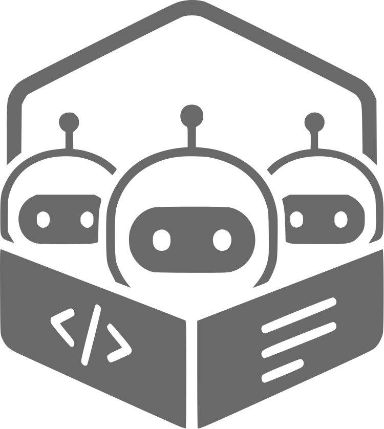
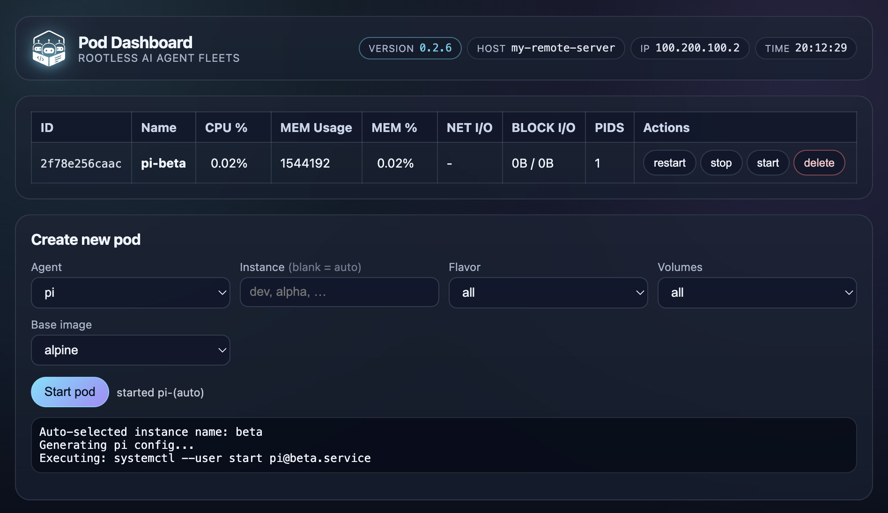

<div align="center">



# Pod Agents Manager

**A rootless Podman + Quadlet fleet manager for running and orchestrating local AI coding agents.**

[](.pod_agents_config/version.conf)
[](https://github.com/robvanvolt/pod-agents-manager/actions/workflows/tests.yml)
[](LICENSE)
[](https://robvanvolt.github.io/pod-agents-manager/)
[](https://www.gnu.org/software/bash/)
[](https://podman.io/)

</div>

---

Running half a dozen local coding agents in parallel — Claude Code in one window, OpenCode in another, a Crush instance churning through a refactor — usually means six terminals, six workspaces stomping each other, and no idea which one is actually doing work. `pod` turns any Linux box with rootless Podman into a multi-tenant home for those agents: each instance lives in its own isolated container with a persistent workspace, talks to your local OpenAI-compatible inference server, and is started, joined, mirrored across `tmux`, batch-prompted, or torn down with one command.

Ships with plugins for Claude Code, OpenCode, Crush, Pi, Hermes, and Nanocoder. A small Go-backed web dashboard exposes the same control surface over the LAN.

<div align="center">
  
</div>

## Why pod-agents-manager?

- **vs. running agents directly on the host** — every agent gets its own filesystem, its own `~/.config`, and its own workspace. A misbehaving agent can't trash another's state, and `pod delete` is a clean reset.
- **vs. plain Docker / Docker Compose** — rootless Podman + Quadlet means no daemon, no socket, no root. Pods are real systemd user units, so they restart on boot, integrate with `journalctl`, and survive the parent shell exiting without bespoke supervisor scripts.
- **vs. devcontainers** — devcontainers solve "one repo, one container." `pod` solves "one fleet of long-lived agents, many repos, one host," with batch prompting and a LAN dashboard on top.
- **vs. Kubernetes / k3s** — no control plane, no YAML, no networking layer to debug. Single Bash file, single Go binary. Designed for one machine you already own.

## Highlights

- **Single-file CLI, no daemons.** One `~/.pod_agents` Bash function loads numbered helper modules from `~/.pod_agents_config/lib/*.sh`. Quadlet generates the systemd units, Podman runs them rootless under your user.
- **Pluggable agents and composable flavors.** Drop a `<name>.sh` into `~/.pod_agents_config/agents/` and it's auto-discovered, gets its own image, gains a CLI verb. Containerfile flavors (`bun`, `uv`, …) and bases (`alpine`, `trixie-slim`) layer on automatically.
- **Batch prompting and `tmux` grid.** `pod batch prompts.txt` fans a list of prompts across every running pod, sequentially or `--concurrent`. `pod tmux` opens a tiled grid with one pane per running pod for instant visual telemetry.
- **Native LAN dashboard.** `pod server start` runs a static Go binary on the host (no nested containers, uses host Podman directly). Bound on `0.0.0.0`, prints every reachable IP, exposes JSON APIs for stats, info, action, and create.
- **Persistence done right.** Per-instance workspaces live at `~/Developer/<agent>-pods/<instance>/`. `remove` keeps the data; `delete` wipes it. Skills under `~/.pod_agents_config/skills/` are read-only-mounted into every pod, so updating once propagates to every agent.

## Architecture

```
┌─ host (Debian / Alpine / anything with rootless Podman + systemd) ────────┐
│                                                                            │
│   ~/.pod_agents              ← single-file entrypoint (the `pod` function) │
│   ~/.pod_agents_config/                                                    │
│     ├─ .env                  ← POD_OPENAI_BASE_URL, POD_DEFAULT_MODEL, ... │
│     ├─ version.conf          ← POD_AGENTS_VERSION (single source of truth) │
│     ├─ lib/NN-*.sh           ← numbered modules sourced in order           │
│     ├─ agents/<name>.sh      ← agent plugins (build + config)              │
│     ├─ flavors/*.containerfile   ← optional Containerfile snippets         │
│     ├─ volumes/*.volumes     ← reusable named volume bundles               │
│     ├─ skills/<skill>/       ← shared, read-only-mounted skills            │
│     ├─ batch/<id>/           ← batch state, logs, progress                 │
│     └─ server/               ← Go dashboard (binary runs on host)          │
│                                                                            │
│   ~/Developer/<agent>-pods/<instance>/   ← per-pod persistent workspace    │
│   ~/.config/containers/systemd/<agent>@.container   ← Quadlet units        │
│                                                                            │
│   pod-<agent>-<instance>     ← running rootless container (Podman)         │
│        └─ /workspace ↔ host workspace                                      │
│        └─ /srv/skills (ro)   ↔ host skills dir                             │
│        └─ env: OPENAI_BASE_URL, ANTHROPIC_BASE_URL, LLM, ...               │
└────────────────────────────────────────────────────────────────────────────┘
```

The shell function generates a Quadlet `*.container` template per agent, lets `systemctl --user daemon-reload` materialize it into a transient unit, and starts the pod via `systemctl --user start <agent>@<instance>.service`. Builds are cached at `~/.cache/podman-containers/`; image tags include both flavor and base, so cache hits are exact.

`pod update` rebuilds and restarts agent images. `pod self-update` refreshes the manager itself by downloading the latest repository snapshot and updating files in `~/.pod_agents` and `~/.pod_agents_config/` (your `.env` and any custom plugins are left in place).

## Requirements

| Component | Minimum | Notes |
|---|---|---|
| Linux | any modern distro | tested on Debian 12, Ubuntu 22.04+, Fedora 39+ |
| Podman | 4.4+ recommended, 5.8+ ideal | `pod` masks the buggy `podman-user-wait-network-online.service` on 5.0–5.7 automatically |
| systemd (user) | yes | rootless Podman uses `systemctl --user` and Quadlet |
| Bash | 4+ on the runtime host | the lint/test suite runs on 3.2+ for macOS dev machines |
| `tmux` | optional | needed for `pod tmux` and `pod batch tmux` |
| `go` | not required on host | dashboard binary is built in a transient `golang:alpine` builder if Go is missing |

An OpenAI-compatible inference endpoint is what each agent talks to. On first `pod` start, missing `POD_*` values are prompted once and saved to `~/.pod_agents_config/.env`; later changes go through `pod config` or by editing that file.

## Installation

```bash
curl -fsSL https://raw.githubusercontent.com/robvanvolt/pod-agents-manager/main/install.sh | bash
exec bash -l

pod doctor          # verify the host is ready
pod start pi dev    # first start prompts once for missing POD_* values
pod prebuild        # (optional) prebuild every agent's image
```

Manual install from a clone:

```bash
git clone https://github.com/robvanvolt/pod-agents-manager.git
cd pod-agents-manager
bash ./install.sh
exec bash -l
```

Development channel install from the `dev` branch:

```bash
curl -fsSL https://raw.githubusercontent.com/robvanvolt/pod-agents-manager/dev/install-dev.sh | bash
exec bash -l

pod doctor
```

Use the dev channel for testing the next release before it is promoted to
`main`. It writes the same `~/.pod_agents` and `~/.pod_agents_config` managed
files as the regular installer, but fetches `POD_AGENTS_REF=dev`.

Tab-completion is registered automatically. Type `pod ` and hit `<Tab>`.

Upgrade later without touching your `.env` or custom plugins:

```bash
pod self-update
```

## Quickstart

```bash
pod start pi dev                      # spin up a Pi agent on the alpine base
pod join pi dev                       # join its tmux session
pod tmux                              # watch every running pod side-by-side
pod server start                      # bring up the LAN dashboard (0.0.0.0:1337)
pod batch prompts.txt                 # fan prompts across every running pod
pod batch pi prompts.txt --concurrent # …or only across `pi` pods, in parallel
pod stop pi dev                       # stop (keeps the workspace)
pod delete pi dev                     # stop + remove the workspace
```

Run `pod` with no args for an interactive menu.

## Showcase: a Friday-afternoon refactor run

A worked example of what the fleet is for:

```bash
# Spin up four Pi pods, one per repo area you want refactored in parallel.
pod start pi auth
pod start pi billing
pod start pi reports
pod start pi web

# Open the grid so you can watch all four agents at once.
pod tmux

# Bring up the LAN dashboard so you can check progress from your phone.
pod server start

# Fan out a list of refactor prompts. --concurrent runs one prompt per pod
# in parallel; without it, prompts go round-robin.
pod batch pi refactor-prompts.txt --concurrent

# Walk away. The dashboard shows running / idle per pod, batch stats live in
# `pod batch stats`, and runners are detached with nohup so closing your
# laptop doesn't kill them.
```

When you come back, idle pods are visible at a glance, completed batches have logs and result summaries on disk under `~/.pod_agents_config/batch/<id>/`, and each pod's persistent workspace at `~/Developer/pi-pods/<instance>/` still has every change the agent made — ready for `git diff`.

## Command reference

```
Lifecycle      pod start | stop | restart | status | stats
               pod remove | delete | remove-all | delete-all
Images         pod prebuild [agent] [flavor] [volumes] [base]
               pod update   [agent] [instance]
               pod self-update | cache-clean
Interaction    pod join | enter | it [agent] [instance]
               pod config | tmux [instance]
Batch          pod batch [agent [instance]] <prompts.txt> [--concurrent]
               pod batch tmux | stats | list | stop [id]
Inbox          pod inbox [agent instance] [--json|--clear]
               pod instruct <agent> <instance> <instruction...>
               pod ask <agent> <instance> "Question?" --option A --option B
Dashboard      pod server start | stop | restart | status | logs | build
               pod server token rotate
Diagnostics    pod doctor
Defaults       pod base <alpine|trixie-slim|...>
```

Every action accepts the same positional contract:

```
pod <action> [agent] [instance] [flavor] [volumes] [base]
```

Anything past `<action>` is optional; the interactive menu prompts for what's missing.

## Writing an agent plugin

Each file in `~/.pod_agents_config/agents/<name>.sh` defines two functions and a few env vars:

```bash
# ~/.pod_agents_config/agents/my-agent.sh

AGENT_VOLUME_CONFIG_PATH="/root/.config/my-agent"
AGENT_SKILLS_SUBPATH="agent/skills"           # optional
AGENT_BATCH_INVOKE='my-agent --print "$PROMPT"' # optional

agent_build_containerfile() {
    local build_dir="$1"; local flavor="$2"; local base="$3"
    write_base_node_containerfile "$build_dir" "$flavor" "$base"
    cat <<'EOF' >> "$build_dir/Containerfile"
RUN npm install -g my-agent && npm cache clean --force
CMD ["tail", "-f", "/dev/null"]
EOF
}

agent_generate_config() {
    local config_dir="$1"; local action="$2"
    [ "$action" = "update" ] && return 0
    cat <<EOF > "$config_dir/config.json"
{ "baseUrl": "$OPENAI_BASE_URL", "apiKey": "$OPENAI_API_KEY", "model": "$DEFAULT_MODEL" }
EOF
}

# Optional: runs once per `pod update` cycle (e.g. to pull a base image)
agent_pre_update() { podman pull docker.io/myorg/my-agent:latest; }
```

Auto-discovered the next time you run `pod`. No restart, no registry, no boilerplate.

## The dashboard

`pod server start` builds a static Go binary (in a throwaway `golang:alpine` builder if your host has no Go), then runs it natively on the host so it talks to your real Podman directly — no podman-in-podman, no socket bind-mounts, no UID gymnastics.

| Route | Purpose |
|---|---|
| `GET /` | Single-page dashboard |
| `GET /api/stats` | Cached `podman stats --all --no-stream` JSON, refreshed every 3s |
| `GET /api/info` | Hostname, LAN IPs, server time |
| `GET /api/auth/status` | Current dashboard role and passkey readiness |
| `POST /api/auth/login` | Unlock operator mode with the local bootstrap token |
| `POST /api/auth/logout` | End the operator session |
| `GET /api/agents` | Available agents, flavors, volumes, bases |
| `GET /api/terminal` | Operator-only capture of a pod's `bot` tmux pane for the dashboard overlay |
| `GET /api/terminal/ws` | Operator-only WebSocket stream for live xterm terminal output and input |
| `POST /api/terminal/start` | Start the pod's detached `bot` tmux agent session |
| `POST /api/terminal/input` | Send input to the pod's `bot` tmux pane |
| `GET /api/inbox` | Pending local inbox entries, optionally filtered by agent + instance |
| `POST /api/instruct` | Queue a follow-up instruction into `~/.pod_agents_config/inbox/` |
| `POST /api/pods/{agent}/{instance}/instructions` | REST-shaped alias for queuing pod instructions |
| `POST /api/action` | `start \| stop \| restart \| delete \| remove` an existing pod |
| `POST /api/create` | Create a brand-new pod from agent + instance + flavor + volumes + base |

`GET /api/stats` also adds `ActivityState` and `ActivityDetail` to managed pods
so the dashboard can show whether an agent looks idle or busy. The first-pass
heuristic checks CPU activity and the foreground tmux command in the pod's
`bot` session, then inspects the recent pane output so low-CPU agent CLIs that
are waiting at a prompt are shown as idle.

The dashboard action bar includes a binoculars **View terminal** button. It
opens a terminal overlay that follows the pod's `bot` tmux pane, can start the
agent session when none exists, and can send input to the agent without SSHing
into the host. The overlay uses a WebSocket-backed xterm surface: it sends an
initial tmux capture, attaches a real tmux client inside the pod, forwards raw
xterm input bytes, and resizes the tmux window with the browser terminal. That
keeps tmux UI details like the status line and prefix shortcuts available while
still keeping the browser terminal inside the selected pod. The browser terminal
uses vendored `@xterm/xterm` `6.1.0-beta.216` assets; exact `6.1.0` was not
published on npm when this was added.

Dashboard writes are protected by a local operator token. Viewers can load the
dashboard and inspect stats without a login; creating, deleting, starting,
stopping, restarting, and queuing instructions requires unlocking operator mode.

```bash
pod server token rotate   # prints a one-time operator token
pod server restart
```

Operator sessions are stored as HttpOnly cookies, token hashes and sessions live
in `~/.pod_agents_config/server/auth.json`, and write attempts are appended to
`~/.pod_agents_config/server/audit.jsonl`. `GET /api/auth/status` advertises the
planned SimpleWebAuthn package pair (`@simplewebauthn/browser` and
`@simplewebauthn/server`) so passkeys can plug into the same role/session model.
Dashboard writes also reject cross-origin POSTs and `/api/auth/login` is
rate-limited per client IP before token verification.

**First-time auth setup.** The dashboard starts in viewer mode: stats and pod
lists are visible, but write actions are locked. To unlock operator mode:

```bash
pod server token rotate    # prints a one-time bootstrap token
```

Click **Unlock** in the dashboard and paste the token. The session lasts 24
hours per browser. Lost the token? Run `pod server token rotate` again; active
sessions stay valid until they expire.

All identifiers are validated, ops are whitelisted, ANSI escapes are stripped on the way out. `start` prints every reachable LAN URL so you can hand the link to a teammate.

## Batch processing

`pod batch` fans a prompt list across the fleet:

```bash
pod batch prompts.txt                       # every running pod
pod batch pi prompts.txt                    # only `pi` pods, sequentially
pod batch pi dev prompts.txt --concurrent   # one pod, all prompts in parallel
pod batch tmux                              # live log per active runner
pod batch stats                             # progress + status per runner
pod batch list                              # batch ids
pod batch stop <id>                         # SIGTERM all runners for a batch
```

State lives at `~/.pod_agents_config/batch/<id>/` (input copy, meta, runners, pids, per-pod progress + logs, completion markers). Runners are detached with `nohup` and survive the parent shell exiting.

## Agent inbox

0.4 introduces a small local inbox per pod. Entries are JSONL files under
`~/.pod_agents_config/inbox/<agent>-<instance>.jsonl`, so the CLI, dashboard,
and future notification workers share one queue without a database.

```bash
pod instruct pi dev "Please inspect the failing test and suggest a fix"
pod ask pi dev "Should the app be red or blue?" --option red --option blue
pod inbox pi dev
pod inbox pi dev --json
pod inbox pi dev --clear
```

The dashboard can queue an instruction for an idle pod from the Actions column.
This is intentionally just the queueing layer: agents do not automatically
consume inbox entries yet, which keeps 0.4 safe while the notification and
human-in-the-loop workflow matures.

## Roadmap

Pod Agents Manager is moving toward a small, reliable orchestration layer for
local agent fleets: still shell-native, still rootless-first, but much better at
showing what agents are doing and letting you steer them from the dashboard.
The arc through 1.0 is dashboard awareness (0.3, shipped) →
human-in-the-loop (0.4) → safe sharing (0.5) → polish & demoability (0.6) →
benchmark suite (0.7) → public 1.0.

### 0.3 — dashboard awareness and notification foundations

- Show whether each pod appears **idle**, **running**, or **unknown** in the LAN dashboard.
- Add a normalized pod API with agent, instance, image, ports, workspace path, service state, container state, activity state, and last refresh time.
- Add a server-sent events stream so the dashboard can update without constant polling.
- Add basic write protection for dashboard actions before expanding the API surface.
- Prepare PWA notification support: browser subscription storage, test notifications, and a notification-ready event model.
- Add the first question/instruction APIs:
  - ask a multiple-choice question such as “Should the app be red or blue?”
  - collect the answer from a notification-enabled dashboard/PWA
  - queue new instructions for an idle pod
- Test release candidates through the `dev` channel on a disposable Linux host before promoting to `main`.

### 0.4 — agent inbox and human-in-the-loop workflows

- Add an instruction inbox per pod, backed by simple local files first.
- Add CLI commands such as `pod inbox`, `pod ask`, and `pod instruct`.
- Let the dashboard send follow-up instructions to idle pods.
- Add notification rules for “pod became idle”, “batch completed”, “agent asks a question”, and “pod failed”.
- Add a batch dashboard with progress, ETA, logs, stop controls, and result summaries.
- Support per-pod notes, tags, and favorite workspaces.

### 0.5 — auth and safe LAN sharing

- Add passkey-native dashboard login with SimpleWebAuthn:
  - `@simplewebauthn/browser` in the dashboard/PWA
  - `@simplewebauthn/server` for registration and authentication verification
  - local credential storage under `~/.pod_agents_config/server/`
  - no external identity provider required
- Keep `pod server token rotate` as a recovery/bootstrap path for headless hosts and first-time passkey setup.
- Add read-only and operator roles so a viewer link can be shared without granting `delete`/`create`.
- Add an audit log for every `POST /api/action` and `POST /api/create` call: who, when, which pod, what changed.

### 0.6 — polish and demoability

Everything that turns the working fleet manager into a product you can demo
cold to a stranger.

- **Pod templates** for common workflows: web-app coding, repo triage, research, batch refactors. `pod start --from-template <name>`.
- **Mobile-first PWA polish:** install prompt, offline shell, notification center, quick actions.
- **Dashboard log/journal viewer:** stream `journalctl --user -u <pod>.service` into the dashboard so you don't need shell access to debug a pod.
- **Per-pod resource limits.** Quadlet already supports `MemoryMax=`, `CPUQuota=`, etc. — surface them through `pod start --memory 2G --cpu 1.5` and the dashboard create form.

### 0.7 — benchmark suite and agent comparison

Objective, reproducible numbers for "which local agent is actually good at
which task." This is the milestone that turns the project's pluggable-agent
story into hard data — and the strongest possible hook for the 1.0 launch
post.

- **Pluggable benchmark tasks** under `~/.pod_agents_config/benchmarks/<name>/`, same drop-in convention as agents and flavors. Each task defines a prompt, success criteria, optional input files, and an expected artifact (e.g. `index.html`).
- **A canonical starter task:** "write a single-file portfolio app in one HTML file." Self-contained, judgeable, runnable on any agent.
- **Configurable judge LLM.** The judge is an explicit config knob (`POD_BENCH_JUDGE_MODEL`, `POD_BENCH_JUDGE_BASE_URL`) — no hidden dependency on a specific provider, and the judge's verdict is stored alongside the run so disagreements can be re-judged later.
- **Fan across the fleet** using the existing batch infrastructure. `pod bench run <task>` runs the task on every configured agent in parallel; results are comparable side-by-side.
- **Per-run metrics:**
  - Wall-clock time to completion.
  - **Input tokens split into cached vs. new.** This matters because mlx, vLLM, llama.cpp, etc. cache prefix tokens — a naive total would unfairly penalize agents with longer-but-stable system prompts. The cached/new split is the only fair way to compare token efficiency across agents.
  - Output tokens.
  - Judge score and rationale.
- **CLI surface:** `pod bench list`, `pod bench run <task> [agent]`, `pod bench results <task>`, `pod bench export <task>` (CSV/JSON for sharing).
- **Dashboard view:** comparative results table per task, sortable by score, time, and tokens.
- Results stored under `~/.pod_agents_config/benchmarks/<task>/runs/<id>/` so they're diffable, versionable, and easy to share in a PR or blog post.

### 1.0 — stable public release

1.0 is consolidation, not new features. Concrete commitments:

- **Stable CLI surface.** `pod <action> [agent] [instance] [flavor] [volumes] [base]` won't break in any 1.x release; new behavior arrives via new flags or subcommands.
- **Stable plugin contract.** `agent_build_containerfile`, `agent_generate_config`, and the `AGENT_*` env vars are frozen. Plugins written for 1.0 keep working through 1.x.
- **Stable on-disk layout.** `~/.pod_agents_config/` and `~/Developer/<agent>-pods/<instance>/` paths are guaranteed; `pod self-update` migrates older layouts forward.
- **JSON everywhere.** `pod status --json` and `pod doctor --json` so the dashboard never has to scrape Podman text output and external tools have a stable contract.
- **Diagnostics bundle.** `pod doctor --bundle` exports a redacted tarball for bug reports.
- **Documented upgrade path** from any 0.x to 1.0, with `pod doctor` flagging anything that needs manual attention.
- **A real demo.** Recorded GIFs of the dashboard, `tmux` grid, and a batch run; a sample-prompts repo; the Friday-refactor showcase reproducible in five commands; a published benchmark scorecard from 0.7 covering at least three agents on the canonical task.
- Public announcement on r/selfhosted, r/LocalLLaMA, r/commandline once the above are in place.

### Post-1.0 (1.x and beyond)

Deferred deliberately so 1.0 freezes a coherent surface:

- **Inter-pod messaging.** Pods drop structured messages into each other's inboxes — natural extension of 0.4's local-file inbox, but a new capability that 1.0 shouldn't add.
- **Metrics history.** Persist activity / CPU / memory over time so the dashboard can show trend graphs.
- **Plugin registry conventions** for community agents, flavors, volume bundles, and skills.
- **Compatibility matrix** for local inference servers (llama.cpp, vLLM, LM Studio, Ollama) — docs work, can land any time it's useful.
- **Release tooling** improvements: changelog generation, preflight checks, rollback hints.

### Non-goals

- **No Docker backend.** Rootless Podman + Quadlet is the identity of the project. Supporting Docker would double the test matrix and force a lowest-common-denominator API. If Docker support ever happens, it'll be a sibling project, not a backend toggle.
- **No built-in scheduling.** Cron, systemd timers, and `at` already exist; wrapping them adds surface area without value.
- **No remote control plane.** This is a single-host fleet manager. Multi-host orchestration is a different product.

## Development & contributing

Source layout:

- `.pod_agents` — entrypoint that defines the `pod` function and sources the modules in numeric order.
- `.pod_agents_config/lib/NN-*.sh` — numbered helper modules (env, build/pick, help/sync, early-flags, interactive menu, arg-parse, doctor, server, batch, lifecycle).
- `.pod_agents_config/agents/`, `flavors/`, `volumes/`, `skills/`, `server/` — pluggable extension points.
- `tests/run.sh` — single-file lint + sham-test runner.
- `.github/workflows/tests.yml` — runs the suite on every push and PR.

Run the suite locally (no Podman or systemd needed — the tests sandbox a fake `$HOME`):

```bash
bash tests/run.sh
```

The suite covers `bash -n` syntax, `shellcheck` errors, the lib loader contract (numeric prefixes + sentinel exit codes), install/self-update regression guards, sandboxed smoke tests for `--help` / `--version` / `doctor`, helper-function unit tests, and a regression check that `pod --version` matches `version.conf`.

The proposed 0.3 plan lives in [docs/ROADMAP-0.3.md](docs/ROADMAP-0.3.md).

**Releasing.** `.pod_agents_config/version.conf` is the single source of truth for the version. Bumping it (e.g. `0.2.2n` → `0.2.2o`), committing, and pushing is the entire release flow — the version badge in this README is read live from that file, and the test suite asserts `pod --version` agrees with it.

**Branching.** Keep `main` as the stable install channel, use `dev` for small
release-prep changes, and open named feature branches for larger work such as
PWA notifications or new orchestration APIs. Merge large branches into `dev`
first, test on a disposable Linux host, then fast-forward or PR `dev` into
`main` for release.

PRs welcome for additional flavors, agents, skills, and bug fixes.

## License

Licensed under the Apache License, Version 2.0 — see [LICENSE](LICENSE).

## Acknowledgements

- [Podman](https://podman.io/) and [Quadlet](https://docs.podman.io/en/latest/markdown/podman-systemd.unit.5.html) — rootless, daemonless, systemd-native containers.
- The agent CLIs themselves: [Claude Code](https://docs.claude.com/en/docs/claude-code/overview), [OpenCode](https://github.com/opencode-ai/opencode), [Crush](https://github.com/charmbracelet/crush), [Pi](https://github.com/mariozechner/pi-coding-agent), [Hermes](https://nousresearch.com/), [Nanocoder](https://github.com/Nano-Collective/nanocoder).
- Local-inference projects that made running these agents on your own hardware viable: [llama.cpp](https://github.com/ggerganov/llama.cpp), [vLLM](https://github.com/vllm-project/vllm), [LM Studio](https://lmstudio.ai/), [Ollama](https://ollama.com/).
